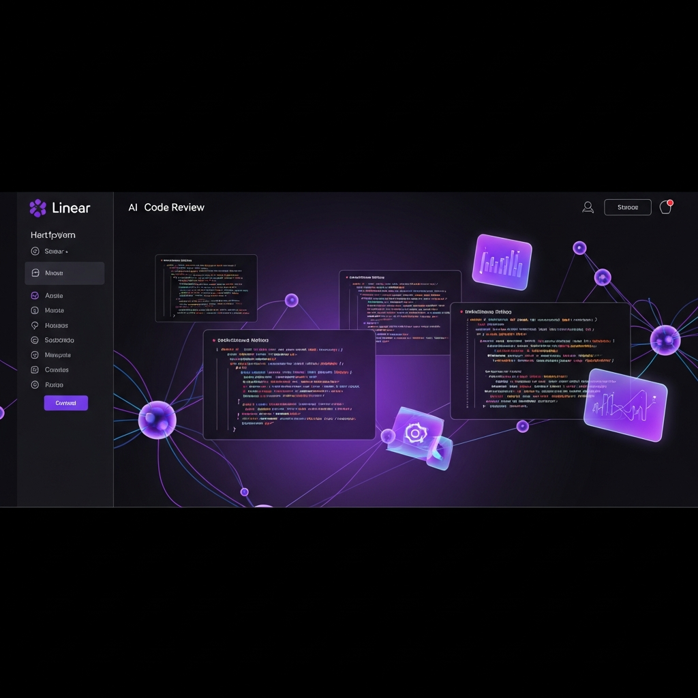
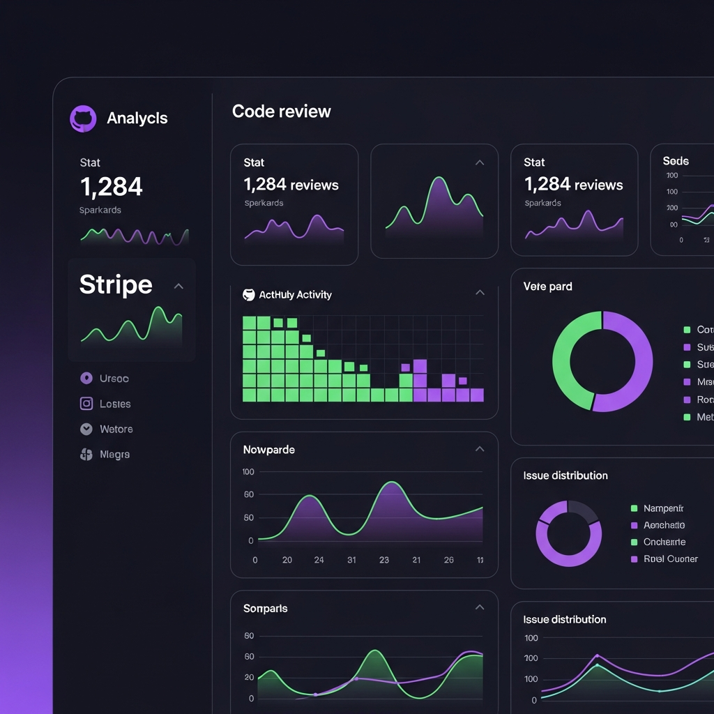
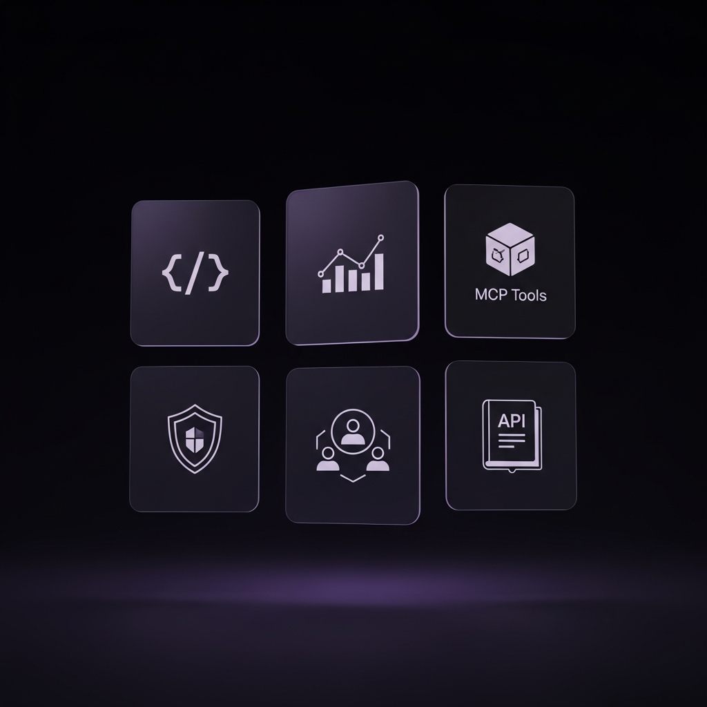

<div align="center">

# AI CodeReview Portal

**AI-Powered Enterprise Code Review & MCP Tools Platform**

Modern dark-themed analytics portal for managing AI code reviews, MCP tool integrations, and quality metrics — inspired by Linear, Vercel, and Stripe dashboard design.



[](https://nextjs.org/)
[](https://www.typescriptlang.org/)
[](https://tailwindcss.com/)
[](LICENSE)
[](https://codereview.rxcloud.group)

[Live Demo](https://codereview.rxcloud.group) &nbsp;&middot;&nbsp; [Features](#features) &nbsp;&middot;&nbsp; [Tech Stack](#tech-stack) &nbsp;&middot;&nbsp; [Getting Started](#getting-started) &nbsp;&middot;&nbsp; [Architecture](#architecture)

</div>

---

## Overview

AI CodeReview Portal is a modern web application that provides a centralized platform for AI-powered code reviews, MCP (Model Context Protocol) tool management, and code quality analytics. Built with a world-class dark-themed UI, it delivers enterprise-grade insights through an intuitive dashboard experience.



## Features



### Dashboard
- **Bento grid layout** with asymmetric stat cards and inline sparklines
- **Activity heatmap** — GitHub contribution graph-style visualization of review density
- **Real-time metrics** — total reviews, active reviews, quality scores, issue tracking
- **Trend charts** — area charts with gradient fills showing 12-month trends
- **Issue distribution** — interactive donut chart with category breakdown

### Code Reviews
- **Review management** — create, track, and filter reviews by status
- **Quality scoring** — color-coded scores (green/blue/amber/red) with threshold indicators
- **Status tracking** — pending, processing, completed, failed with pulsing status dots
- **Repository integration** — branch, commit hash, and language detection

### MCP Tools
- **7 integrated tools** — App Analyzer, Team Assistant, Deploy Manager, DB Query, Data Insight, Code Repository, Log Analyzer
- **Health monitoring** — real-time health status with call count and response time metrics
- **Category filtering** — filter tools by analysis, monitoring, database, deployment, code
- **One-click invocation** — invoke tools directly from the portal

### Analytics & Reports
- **Multi-dimensional analysis** — area, bar, pie, and radar charts
- **Repository rankings** — ranked by review count with inline progress bars
- **Quality radar** — 6-axis radar chart (Security, Performance, Style, Maintainability, Coverage, Docs)
- **Time range filtering** — 3m / 6m / 12m data views
- **Export capability** — export analytics data

### Settings & Configuration
- **API token management** — create, copy, revoke tokens with status indicators
- **Notification preferences** — granular control over alerts
- **User preferences** — theme, language, email settings

### Command Palette
- **`⌘K` global search** — navigate anywhere instantly with keyboard
- **Arrow key navigation** — full keyboard support
- **Fuzzy search** — find pages and actions by typing

---

## Tech Stack

| Layer | Technology | Purpose |
|-------|-----------|---------|
| **Framework** | Next.js 14 (App Router) | React SSR/SSG framework |
| **Language** | TypeScript 5.6 | Type safety |
| **Styling** | Tailwind CSS 3.4 | Utility-first CSS |
| **Charts** | Recharts 2.12 | Data visualization |
| **Animation** | Framer Motion 11 | Smooth transitions |
| **Font** | Inter (Google Fonts) | Dashboard typography |
| **Icons** | Heroicons (inline SVG) | UI iconography |

### Design System

- **Color base**: Zinc-black `#09090b` with `#111114` card surfaces
- **Accent**: Violet `#8b5cf6` — single accent for brand cohesion
- **Typography**: Inter with `tabular-nums` for metric alignment
- **Cards**: 12px radius, 1px border `rgba(255,255,255,0.06)`, solid backgrounds
- **Grid**: Subtle 48px background grid pattern

---

## Getting Started

### Prerequisites

- Node.js 18+
- npm or yarn

### Installation

```bash
# Clone the repository
git clone https://github.com/kevinten-ai/ai-codereview-web.git
cd ai-codereview-web

# Install dependencies
npm install

# Start development server
npm run dev
```

Open [http://localhost:3000](http://localhost:3000) in your browser.

### Build

```bash
# Production build
npm run build

# Start production server
npm start
```

---

## Architecture

```
src/
├── app/                    # Next.js App Router pages
│   ├── layout.tsx          # Root layout (sidebar + header)
│   ├── page.tsx            # Redirect to /dashboard
│   ├── dashboard/          # Bento grid dashboard with charts & heatmap
│   ├── reviews/            # Code review management table
│   ├── tools/              # MCP tool cards with health monitoring
│   ├── reports/            # Analytics with area/bar/pie/radar charts
│   ├── settings/           # Preferences, tokens, notifications
│   ├── docs/               # API reference & best practices
│   └── globals.css         # Design system (cards, badges, inputs, etc.)
├── components/
│   └── layout/
│       ├── Sidebar.tsx     # Linear-style grouped navigation
│       └── Header.tsx      # Search trigger + ⌘K command palette
├── lib/
│   ├── mock-data.ts        # Complete mock dataset for all pages
│   └── utils.ts            # Formatters, classname helpers
└── types/
    └── index.ts            # TypeScript interfaces
```

### Design Principles

1. **Information density** — dashboard-first design where metrics are visible at a glance
2. **Single accent** — violet `#8b5cf6` used consistently, other colors reserved for semantics
3. **Keyboard-first** — `⌘K` palette, arrow keys, enter to navigate
4. **Minimal chrome** — content speaks, UI gets out of the way

---

## Pages

| Route | Description |
|-------|-------------|
| `/dashboard` | Bento grid stats, sparklines, area chart, heatmap, activity feed |
| `/reviews` | Filterable review table with status badges and score indicators |
| `/tools` | MCP tool card grid with health monitoring and invocation |
| `/reports` | Multi-chart analytics with radar, area, bar, and pie visualizations |
| `/settings` | General preferences, API token management, notification config |
| `/docs` | Quick start guide, API reference, best practices, security, FAQ |

---

## License

MIT

---

<div align="center">
  <sub>Built with Next.js, Tailwind CSS, and Recharts</sub>
</div>
